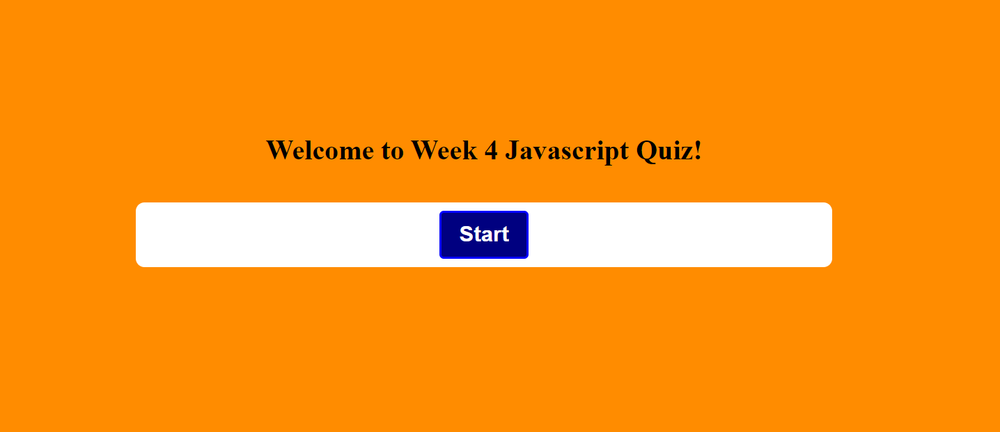

# budget-tracker
Challenge 4 U of A 

## Badge

None Applicable 

## Description

A application for to quiz yourself or friends on javascript subjects, and see who can get the highest score.

## Table of Contents

- [Usage](#usage)
- [Installation](#installation)
- [Walkthrough](#walkthrough)
- [Languages](#languages)
- [Tests](#tests)
- [License](#license)
- [Credits](#credits)
- [Questions](#questions)

## Usage

Downloading the zip file from my github or forking the repo will allow you to use this code as a starting point for your own projects. 
The simple open the html file in brower which will allow it to function. The application does allow for high score to be kept in local storage.

## Installation

None Applicable 

## Walkthrough or Screenshot

## Langauges

- Javascript
- css
- html

## Tests
None Applicable 

## License

Copyright (c) 2021

## Credits

- University of Arizona Ta,s and Tutors

## Questions

- Bryan Daniel 
    - GitHub [AZBDaniel](https://github.com/AZBDaniel)